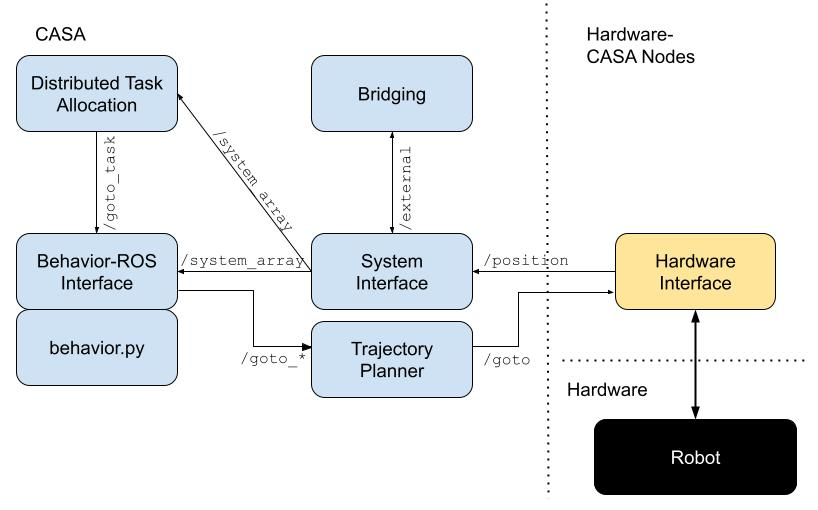

## The Collaborative Aerial Swarm Architecture (CASA) ##

Welcome to the main repo for the Collaborative Aerial Swarm Architecture, dubbed CASA for short. The goal of this arcitecture is to leverage open-source software as much as possible to create teh most robust aerial swarming architecure available. We will use ROS2 and PX4-micro-XRCE-DDS on a companion computer talking to a pixawk (running non-custom firmware) via a ftdi cable.

#### Architecture ####
The image shows the current arcitecture of CASA. 

At the heart of CASA is the System Interface Node, this node organizes the data from the each other eagent in the swarm and passes it along via the `/system_array` topic so that other nodes can use it to make informed decisions and plan.  

The Distributed Task Allocation node is an implementation of a novel task allocation alogorithm designed for multi-robot systems. This will read in tasks via a kml file and allocate each agent to a task optimally. More tasks can be added in whenever. This node is still under development.

The behavior-ros interface node is the backend for each behavior that is written. It takes in all the information from the system interface and puts it in class varaibles so the behavior has access to it (via inheritance). Once the behavior sets a waypoint or velocity the behavior-ros interface either converts it to local frame or passes it straigt to the trajectory planer node to control the agent.

Bridging is still under contruction, but this plans to make sharing sensor data amongst the swarm extremely easy by bridging any topic with the `/external` namespace. 

To run CASA see this [guide](src/casa_bringup/README.md).
To run a behavior or create a new one, see this [guide](src/behaviors/README.md).

See the [dev notes](docs/dev.md) 

