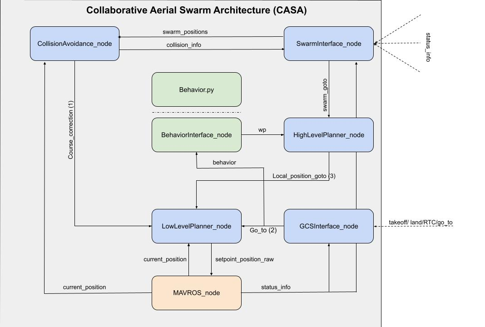

## The Collaborative Aerial Swarm Architecture (CASA) ##

Welcome to the main repo for the Collaborative Aerial Swarm Architecture, dubbed CASA for short. The goal of this arcitecture is to leverage open-source software as much as possible to create teh most robust aerial swarming architecure available. We will use ROS2 and PX4-micro-XRCE-DDS on a companion computer talking to a pixawk (running non-custom firmware) via a ftdi cable.

#### Architecture ####
The image shows the planned architecure for CASA including nodes and topics. Please note that this is subject to change as developement proceeds.

See the [dev notes](docs/dev.md) 

