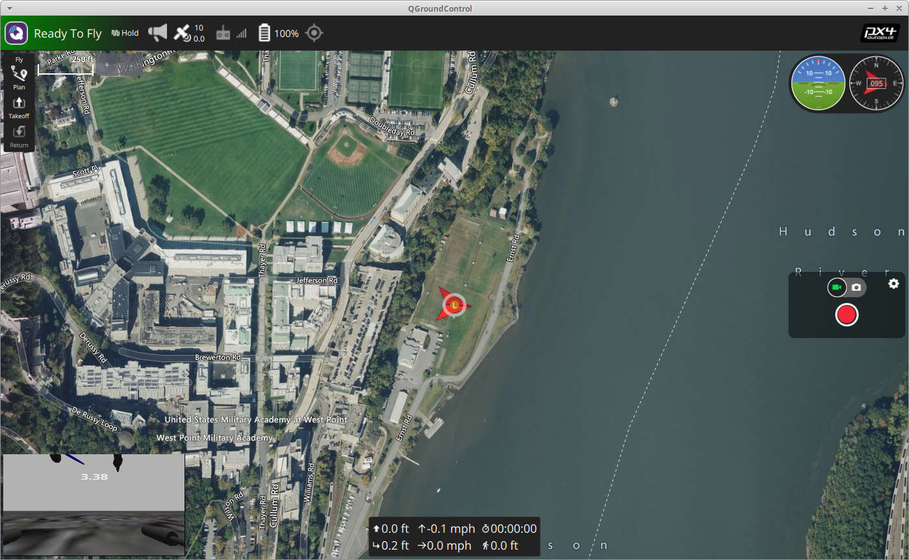
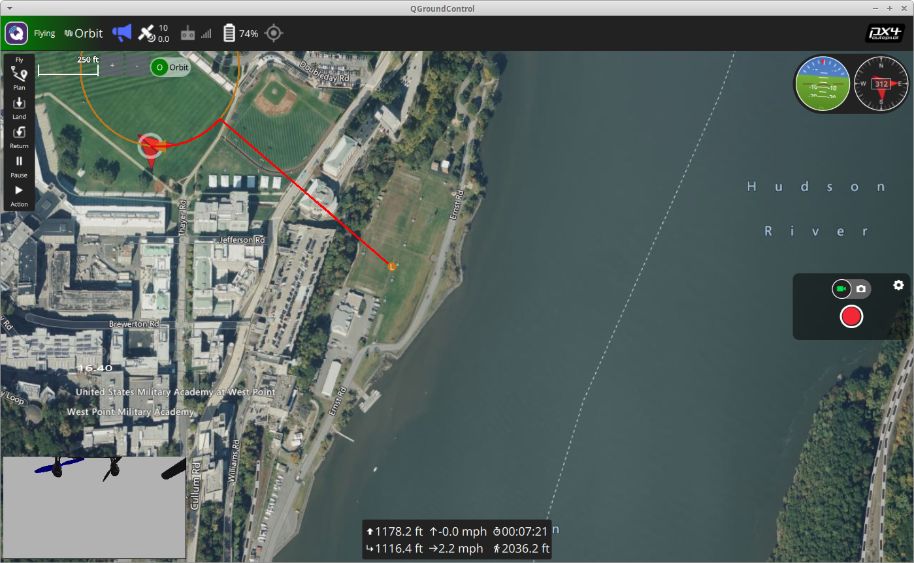

# CASA Software in the Loop Simulation (SITL)

- [CASA Software in the Loop Simulation (SITL)](#casa-software-in-the-loop-simulation-sitl)
  - [Overview](#overview)
  - [Requirements](#requirements)
  - [Usage](#usage)
    - [Starting the simulator](#starting-the-simulator)
  - [Connecting  with QGroundControl](#connecting--with-qgroundcontrol)
  - [Connecting with ROS2](#connecting-with-ros2)
    - [Installation](#installation)
    - [Monitor Test Sript](#monitor-test-sript)
    - [Orbit Test Script](#orbit-test-script)

## Overview

The CASA SITL capability is currently provided by the [px4-gazebo-headless](https://github.com/JonasVautherin/px4-gazebo-headless) docker image.

This docker image includes gazebo, px4, and mavlink and is a "batteries-included" simulator that can be connected directly to a MAVROS component and QGroundControl.

For now, we are using version 1.13.0 of the `px4-gazebo-headless` container.  In the futute, we may upgrade versions or potentially fork this work to meet our own requirements

## Requirements

  * Docker
  * QGroundControl (optional)
  * ROS2 (optional)

## Usage

### Starting the simulator

Use the following to start the simulator:

```
./run_sitl.sh
```

In this configuration, the container will send MAVLink to the host on ports 14550 (for QGC) and 14540 (for MAVROS).
It also uses the typhoon_h480 which has video.


If you would like to specify a starting location, you can modify the `PX_HOME_` environment variables in the docker command inside the `run_sitl.sh` script.

Please see the [px4-gazebo-headless repo](https://github.com/JonasVautherin/px4-gazebo-headless) for more sophisticated networking setups and other options

## Connecting  with QGroundControl

If you are running [QGroundControl](https://docs.qgroundcontrol.com/master/en/getting_started/download_and_install.html) running on the same machine, it should pick up the simulated drone without issue.

To enable the camera view, select the "Q" wifi-looking icon in upper left, then Application Settings > General

Scroll down under FLy View, video settings, and change source to `RTSP Video Stream` and enter the following uri:

```
rtsp://127.0.0.1:8554/live 
```

Keep all the other defaults, then select Back in upper left to save and return to top.




You can issue any MAVLINK command using QGroundController and this is a good way to ensure you are familiar with how the drone operates.

## Connecting with ROS2

The `tests` folder has some ROS2 python scripts for testing the ROS2 connections.  They can be used as templates or inspiration for CASA components.

### Installation

```
python3 -m venv ve-ros
source ve-ros/bin/activate
pip install -r requirements
```

### Monitor Test Sript

This script will monitor the SITL MAVROS port for drone telemetry:

```
python monitor.py
```

This will stream position and orientation pulled from MavLink using a ROS2 client:

```
attitude: EulerAngle: [roll_deg: -0.19738507270812988, pitch_deg: -0.16422973573207855, yaw_deg: 93.22183990478516, timestamp_us: 1465388000]
attitude: EulerAngle: [roll_deg: -0.19059421122074127, pitch_deg: -0.12733517587184906, yaw_deg: 93.1798095703125, timestamp_us: 1465404000]
position: Position: [latitude_deg: 41.3909354, longitude_deg: -73.95306269999999, absolute_altitude_m: 640.1630249023438, relative_altitude_m: -0.05300000309944153]
.
.
.    
```

It will also retrans sampled position and orientation on its own topic `/sitl_monitor`:


```
ros2 topic echo /sitl_monitor
```

Will show:


```
data: '{"name": "sitl_monitor", "sample": 25, "position": "Position: [latitude_deg: 41.3909355, longitude_deg: -73.9530649, absolute_al...'
---
data: '{"name": "sitl_monitor", "sample": 26, "position": "Position: [latitude_deg: 41.3909355, longitude_deg: -73.953065, absolute_alt...'
---
data: '{"name": "sitl_monitor", "sample": 27, "position": "Position: [latitude_deg: 41.3909355, longitude_deg: -73.953065, absolute_alt...'
---
data: '{"name": "sitl_monitor", "sample": 28, "position": "Position: [latitude_deg: 41.3909356, longitude_deg: -73.953065, absolute_alt...    
```

### Orbit Test Script

This script will launch the drone and send it to an orbit point:

```
python orbit.py
```

It also publishes samples of its position on the ros topic `/sitl_orbit`


